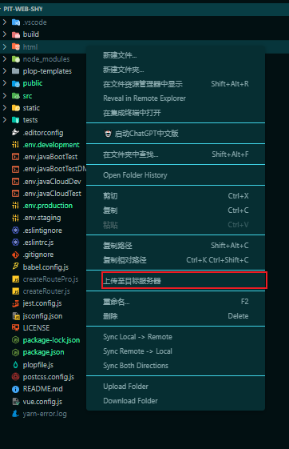

<!--
 * @Author: “wuziyang” “764401855@qq.com”
 * @Date: 2023-03-31 11:32:54
 * @LastEditors: “wuziyang” “764401855@qq.com”
 * @LastEditTime: 2023-04-19 21:04:14
 * @FilePath: \pitsftp\README.md
 * @Description: 这是默认设置,请设置`customMade`, 打开koroFileHeader查看配置 进行设置: https://github.com/OBKoro1/koro1FileHeader/wiki/%E9%85%8D%E7%BD%AE
-->
## pitSftp插件
作者：湖南创智艾泰克-前端组
#### 介绍
vscode插件，上传文件至服务器，密码加密
#### 使用教程

1.  安装插件之后，我们就可以进行密码加密，ctrl+alt+p 弹出输入框，输入服务器密码，回车您将获得一个经过非对称加密的密码，并且在项目根目录的.vscode文件夹下生成一个pitSftp.json的配置文件
``` json
{
    "name": "My Server", // 配置文件的名字
    "host": "127.0.0.0", // 服务器的ip
    "protocol": "sftp", // 协议，一般不需要修改
    "port": 22,  // 端口号
    "username": "admin", // 服务器的用户名
    "remotePath": "/etc/nginx/html", // 项目部署的地址
    "key": "24e00495-5493-4b7e-9f99-e31c3fabcf75", // 这个key一般不需要修改，自动生成，用于识别公钥与私钥的存放路径
    "password": "GMzmnJrMAG8dWNqwOjpD6aSxUUKdhOnoOrnUIoK/flo9IodWp8u2GWx42BUE0OZ6dU1FTDvkuGF3Hf2ji3yuhw==" // 加密后的密码
}

```
2.  选择要上传的文件夹，右键选择PITSFTP:上传至目标服务器

3.  耐心等待一下，注意右下角弹出的提示

#### 使用说明


#### 参与贡献

1.  Fork 本仓库
2.  新建 Feat_xxx 分支
3.  提交代码
4.  新建 Pull Request

